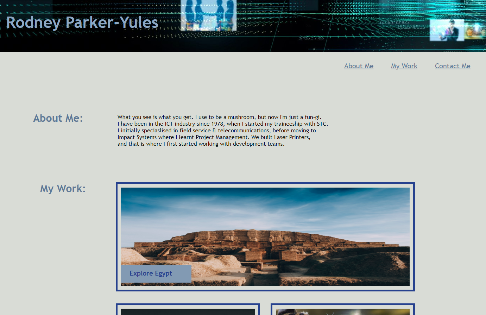

# Assignment:  A2_Portfolio

# My Portfolio

## Description

This website is a work-in-progress. This is the first release, and it will be modified and added to through over the next 3-4 months. 

The purpose of this website is to showcase my skills and projects to potential employers. Whilst I will not be using it for that purpose (as I will not be looking for a job), I am using this exercise, together with the future exercises to modify and upgrade the site as a learning exercise to develop my HTML, CSS & Javascript skills. 

This is important to me as I do have other projects in mind that I do want to develop, which is my motivation for doing this course. 

This project does not solve any problems. However, whilst developing the site I inadvertantly went down the wrong path and built a few bugs into the system, which I then had to troubleshoot. That process involved searching Google for information, tips & tricks; as well as going back through the class recordings and re-doing old exercises; as well as utilising AskBCS.

As I have a minor learning issue this is the best way for me to learn; by creating a mess, breaking it and figuring out how to fix it. So the process of creating, troubleshooting, having to undo chunks of work and then re-building it was a great learning experience. I first built the site using basic HTML & CSS tecniques and it looked good, except there was one bug where I could not get a single immage (my first project placeholder) to align where I wanted it to be. There was also another issue with the "Hover" function not working; so after going around in circles for a number of hours I submitted a ticket to AskBCS re: the hover issue, and we realised the reason why the "hover" function was not working was related to 'Relative Positioning' - which lead to the conclusion that I should have been using Flexbox & other more advanced CSS tecniques. 

The value of this mistake was that through the troubleshooting process I did learn a lot. Whilst the class exercises are interesting and relevant, it is not until you have to use them in a real scenario that you can truely learn that there are typically multiple ways to achieve the same outcome - but the skill is in choosing the most efficient one for that particular requirement. 

## Planned Development

Whilst this website does scale for different PC and tablet screen-sizes, is not truely responsive. Therefore the plan for future releases is to make it look good on a mobile phone, even though that will probably never be required. I am sure the journey to achieving this goal will be interesting, challenging and a great learning experience. 

I am also planning to add more content, as well as linking real projects in place of the placeholders. 

## Version 1.0 Usage

This is not a version that I would send out to a potential employer if I were seeking employment. This is a first draft that will be modified and enhanced over the coming months. 

This particular banner was chosen as the header image as it indicates more than just web development. My experience over many years in the industry include Strategic Business Consulting and Business Process Engineering (BPR) for a range of medium to large companies. The greatest issue with typicval BPR projects and consultants is that they typically spend a lot of time defining "how bad it is" - but then just walk away and leave it to somebody else to figure out how to fix it. 

I refused to do that, and prefered to use my broad range of skills, knowledge & industry contacts to develop and implement a solution that delivered clearly measurable outcomes. 

One of the main issues that I often faced was the need to custom develop web based front ends to legacy systems that were often difficult and expensive to replace. So the challenge was to develop smart front end applications that then updated the legacy systems, often in real time, to improve productivity and eliminate the "Noise" across the organisation - ie the process failure &/or duplication of effort.  

This is where the real saving can typically be found in most organisations, by shaving a few minutes here & there from multiple processes. That may not seem tyo be a lot, but when you can save 30 minutes a day for 7,000 employees that does add up to tens and sometimes hundreds of millions of dollars. 

Why is this relevant?

One of my greatest issues with each BPR project was the need to rely on external resources to develop those web interfaces. Not having control of that process was at times very frustrating, often very expensive, and on a number of occasions did not produce the outcomes that were defined. Once the problems, the potential savings, and the recommended solutions have been presented to clients; they expect the solutions to be implemented in (typically) unrealistic timeframes. 

Not having control of developing the solutions and having to rely totally on external resources has always been a major issue. That is why I decided to do this course, so that I can employ and manage my own resources, and retain full control of the development and implementation processes.   

Whilst the portfolio website will never be used to seek employment, it is a means of setting my own goals, and implementing them in a live environment, so that I can develop the skills I need to be able to control the development & implementation process.  The image attached below is fairly simple in this version, but I am looking forward to building on it. 

```md

```
 ```

## Credits

There were no collaborators with this project. 


## Features

The three links at the top connect to different parts of the site. This is not obvious for the first two since the site is still quite small, but this should change over time. 

The links in "Contact Me" are just placeholders at this point and will be activated in the next version.

The three images depicting my work are also placeholders, and the plan is to connect my assignments in place as they are completed. 


